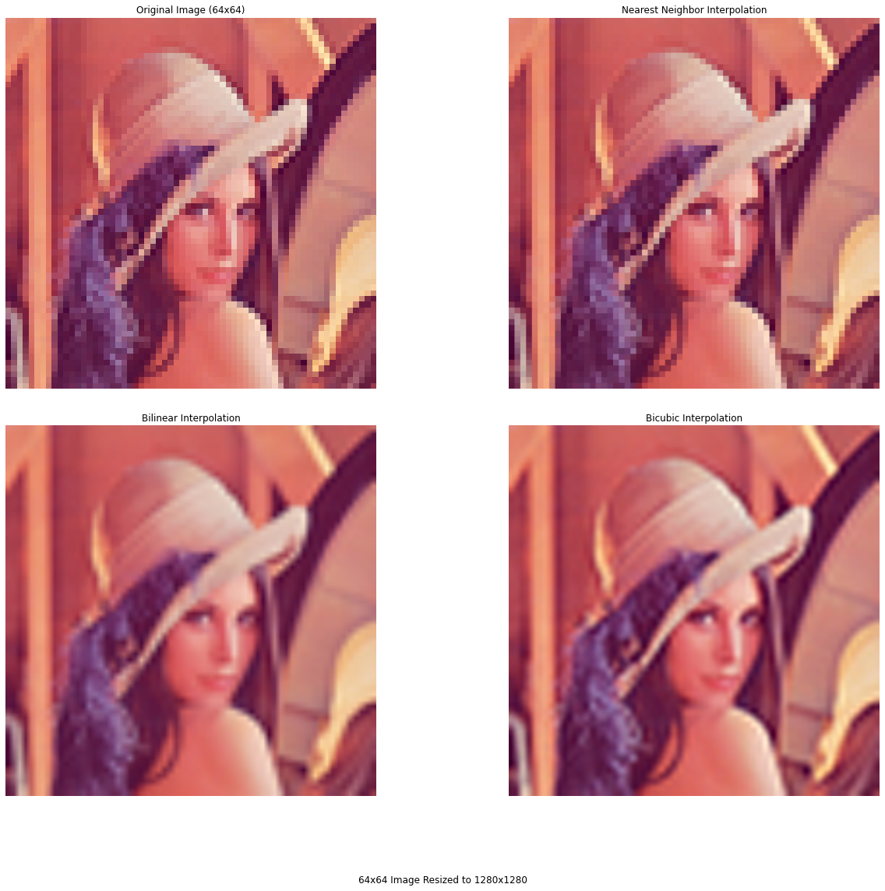
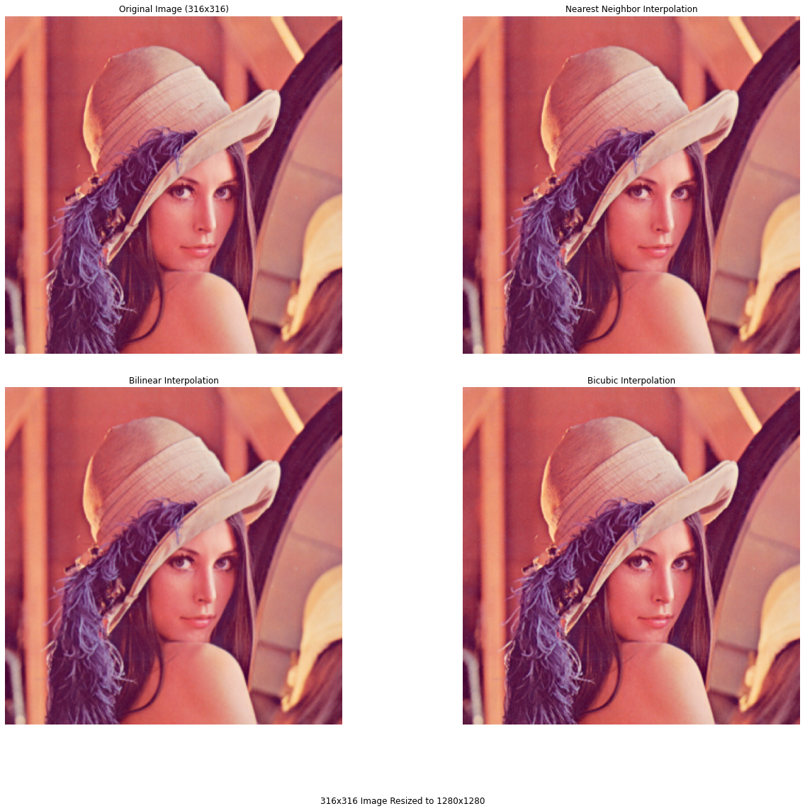

# Image Interpolation

This project implements three image interpolation methods: **Nearest Neighbor**, **Bilinear**, and **Bicubic** interpolation. Each method is applied to resize images from low resolutions to a higher resolution of 1280x1280 pixels. The goal is to observe how each interpolation technique performs when scaling up images of different initial sizes.

## Interpolation Methods:
1. **Nearest Neighbor**: This method uses the nearest pixel value when resizing. It is fast but often results in blocky and jagged edges.
2. **Bilinear**: This method considers the average of the four nearest pixel values, resulting in smoother transitions but sometimes losing sharpness.
3. **Bicubic**: This method calculates the weighted average of 16 nearest pixels, producing the smoothest and most visually appealing results, particularly for natural images.

## Resizing Scenarios:
We applied these methods to three images of increasing resolution:  
- **64x64 resized to 1280x1280**
- **128x128 resized to 1280x1280**
- **316x316 resized to 1280x1280**

### Analysis:

1. **64x64 Resized to 1280x1280**:
   - **Nearest Neighbor**: The result looks very blocky with harsh edges and no smoothness.
   - **Bilinear**: The image is smoother than Nearest Neighbor but still lacks fine detail.
   - **Bicubic**: This method provides the best smoothness and transitions but is still limited by the low-resolution input (64x64).
   
   From this comparison, it is clear that **Nearest Neighbor** struggles to create a good upscaled image, while **Bilinear** and **Bicubic** handle it better, though the lack of data from 64x64 limits their performance.

2. **128x128 Resized to 1280x1280**:
   - **Nearest Neighbor**: Still blocky, but slightly better than the 64x64 scenario.
   - **Bilinear**: Significantly improved, with smoother transitions.
   - **Bicubic**: Produces a clean and visually pleasing result with fewer artifacts.
   
   When resizing from **128x128**, both **Bilinear** and **Bicubic** manage to fill in the missing details quite effectively, and the difference between them becomes more nuanced. **Nearest Neighbor**, however, still struggles with smoothness.

3. **316x316 Resized to 1280x1280**:
   - **Nearest Neighbor**: The result is now acceptable, with less obvious blockiness.
   - **Bilinear**: The image is very smooth with minimal loss of detail.
   - **Bicubic**: Almost indistinguishable from Bilinear, providing excellent smoothness and detail.
   
   By **316x316**, all three methods perform well, showing that the original resolution now provides enough detail for each method to work effectively. **Bilinear** and **Bicubic** both produce high-quality images, and even **Nearest Neighbor** begins to deliver decent results.

### Conclusion:
- At very low resolutions (64x64), **Nearest Neighbor** performs poorly, while **Bilinear** and **Bicubic** provide more useful upscaling.
- By **128x128**, **Bilinear** and **Bicubic** work effectively, with **Bicubic** being slightly better at preserving details.
- When starting from **316x316**, all methods perform well, showing that the amount of original image information significantly affects the quality of upscaled images.

## Visual Comparison:
The following images show the results of each interpolation method:

1. **64x64 Image Resized to 1280x1280** (Nearest Neighbor, Bilinear, Bicubic)

   
2. **128x128 Image Resized to 1280x1280** (Nearest Neighbor, Bilinear, Bicubic)

   
3. **316x316 Image Resized to 1280x1280** (Nearest Neighbor, Bilinear, Bicubic)

   

